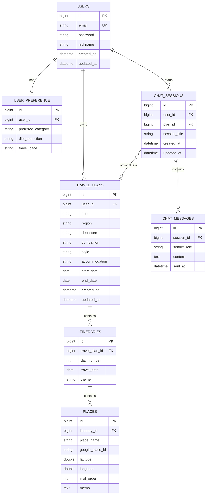

# ERD

현재 JPA 엔티티 기준으로 정리한 ERD입니다.

```mermaid
erDiagram
    USERS ||--o| USER_PREFERENCE : has
    USERS ||--o{ TRAVEL_PLANS : owns
    USERS ||--o{ CHAT_SESSIONS : starts

    TRAVEL_PLANS ||--o{ ITINERARIES : contains
    ITINERARIES ||--o{ PLACES : contains

    CHAT_SESSIONS ||--o{ CHAT_MESSAGES : contains
    CHAT_SESSIONS }o--o| TRAVEL_PLANS : optional_link

    USERS {
      bigint id PK
      string email UK
      string password
      string nickname
      datetime created_at
      datetime updated_at
    }

    USER_PREFERENCE {
      bigint id PK
      bigint user_id FK
      string preferred_category
      string diet_restriction
      string travel_pace
    }

    TRAVEL_PLANS {
      bigint id PK
      bigint user_id FK
      string title
      string region
      string departure
      string companion
      string style
      string accommodation
      date start_date
      date end_date
      datetime created_at
      datetime updated_at
    }

    ITINERARIES {
      bigint id PK
      bigint travel_plan_id FK
      int day_number
      date travel_date
      string theme
    }

    PLACES {
      bigint id PK
      bigint itinerary_id FK
      string place_name
      string google_place_id
      double latitude
      double longitude
      int visit_order
      text memo
    }

    CHAT_SESSIONS {
      bigint id PK
      bigint user_id FK
      bigint plan_id FK
      string session_title
      datetime created_at
      datetime updated_at
    }

    CHAT_MESSAGES {
      bigint id PK
      bigint session_id FK
      string sender_role
      text content
      datetime sent_at
    }
```

## 참고
- `CHAT_SESSIONS.plan_id`는 nullable(선택 연결)입니다.
- 타임스탬프(`created_at`, `updated_at`)는 `BaseEntity` 감사 필드로 관리됩니다.

